# Common Design Patterns of LLM-based AI Agents

LLM-based AI Agents will be used in a variety of [applications and use cases](/3-applications-and-use-cases.md). They may looks different, however, there are limited number of design patterns to enable each applications. We can abstract the common design patterns and will help us to choose the best pattern for our particular purpose by making it moduler and configurable. [This paper](https://arxiv.org/pdf/2405.10467) had developed good foundation. 

## Common Design Patterns

### Passive Goal Creator Design Pattern
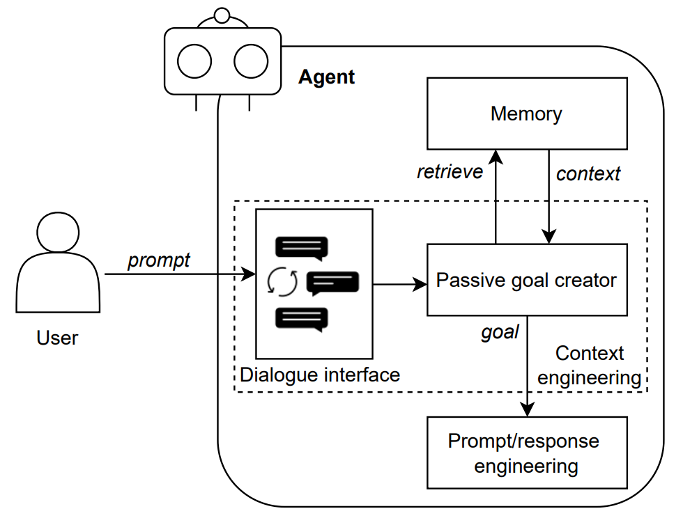

A agent with passive goal creator design pattern provides a dialogue interface where users can directly specify the context and problems, which are transferred to passive goal creator for goal determination. Meanwhile, the passive goal creator can also retrieve related information from memory, including the repository of artefacts being worked on, relevant tools used in recent tasks, conversation histories, and the positive and negative examples, which are appended to the user’s prompt for goal-seeking. The generated goals are sent to other components for further task decomposition and completion. In this case, the agent passively receives input from users and generates the strategies to refine and clarify users’ goals, as it only receives the context information directly provided by users. Please note that in multi-agent systems, an agent can send prompts by invoking the API of another agent to assign specific task, while the latter agent analyses the received information and determine the goal.

| Facts | Notes |
| --- | --- |
| Summary:| Passive goal creator analyses users’ articulated goals through the dialogue interface.|
| Context:| When querying agents to address certain issues, users provide related context and explain the goals in prompts.|
| Problem:| Users may lack expertise of interacting with agents, and the provided information can be ambiguous for goal achievement.|
| Forces: | - Underspecification. Users may not be able to provide thorough context information and specify precise goals to agents. - Efficiency. Users expect quick responses from agents.|
| Benefits: | - Interactivity. Users or other agents can interact with an agent via a dialogue interface or related APIs.   - Goal-seeking. The agent can analyse user-provided context and retrieve related information from memory, to identify and determine the objectives and create corresponding strategies.   - Efficiency. Users can directly send prompts to the agent through the dialogue interface, which is intuitive and easy to use. |
| Drawbacks: | - Reasoning uncertainty. Users may have assorted backgrounds and experiences. Unclear or ambiguous context information may intensify the reasoning uncertainties, especially considering there are no standard prompt requirements. |
| Related patterns: | - Proactive goal creator. Proactive goal creator can be regarded an alternative of passive goal creator enabling multimodal context injection.   - Prompt/response optimiser.   - Passive goal creator can first handle users’ inputs and transfer the goals and relevant context information to prompt/response optimiser for prompt refinement.|
| Examples: | - HuggingGPT can generate responses to address user requests via a chatbot. Users’ requests including complex intents can be interpreted as their intended goals.| 

### Proactive Goal Creator Design Pattern
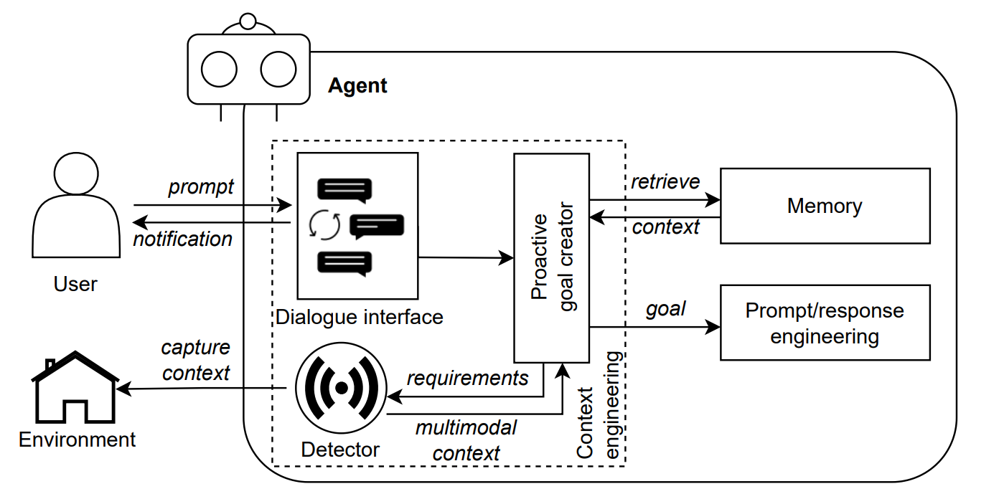

A agent of proactive goal creator received prompts from dialogue interface, and relevant context retrieved from memory, the proactive goal creator can anticipate users’ goals by sending requirements to detectors, which will then capture and return the user’s surroundings with multimodal context information for further analysis and comprehension to generate the goals, for instance, identifying the user’s gestures through cameras, recognising application UI layout via screenshots, etc. Please note the proactive goal creator should notify users about context capturing and other relevant issues with a low false positive rate, to avoid unnecessary interruptions. In addition, the captured environment information can be stored in the agent’s memory (or knowledge base) to establish 'world models' to continuously improve its ability to comprehend the real world.

| Facts | Notes |
| --- | --- |
| Summary: | Proactive goal creator anticipates users’ goals by understanding human interactions and capturing the context via relevant tools. |
| Context: | Users explain the goals that the agent is expected to achieve in the prompt. |
| Problem: | The context information collected via solely a dialogue interface may be limited, and result in inaccurate responses to users’ goals. |
| Forces: | - Underspecification. (i) Users may not be able to provide thorough context information and specify precise goals to agents. (ii) Agents can only retrieve limited information from the memory.   - Accessibility. Users with specified disabilities may not be able to directly interoperate with the agent via passive goal creator. |
| Benefits: | - Interactivity. An agent can interact with users or other agents by anticipating their decisions proactively with captured multimodal context information.   - Goal-seeking. The multimodal input can provide more detailed information for the agent to understand users’ goals, and increase the accuracy and completeness of goal achievement.   - Accessibility. Additional tools can help capture the sentiments and other context information from disabled users, ensuring accessibility and broadening the human values of LLM-based agents. |
| Drawbacks: | - Overhead. (i) Proactive goal creator is enabled by the multimodal context information captured by relevant tools, which may increase the cost of the agent. (ii) Limited context information may increase the communication overhead between users and agents. |
| Related patterns: | - Passive goal creator. Proactive goal creator can be regarded an alternative of passive goal creator enabling multimodal context injection.   - Prompt/response optimiser. Proactive goal creator can first handle users’ inputs and transfer the goals and relevant context information to prompt/response optimiser for prompt refinement.   - Multimodal guardrails. Multimodal guardrails can help process the multimodal data captured by proactive goal creator. |
| Examples: | - GestureGPT can decipher users’ hand gesture descriptions and hence comprehend users’ intents.   - ProAgent can observe the behaviours of other teammate agents, deduce their intentions, and adjust the planning accordingly. |

### Prompt/Response Optimiser Design Pattern

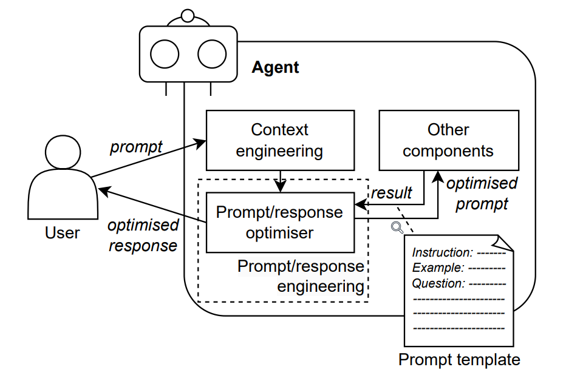

A agent of prompt/response optimiser will take a user input as initial prompts, however, such prompts may be ineffective due to the lack of relevant
context, unintentional injection attacks, redundancy, etc. In this regard, prompt/response optimiser can construct refined prompts and responses
adhering to predefined constraints and specifications. These constraints and specifications outline the desired content and format for the inputs
and outputs, ensuring alignment with the ultimate goal. A prompt or response template is often used in the prompt/response optimiser as a
factory for creating specific instances of prompts or responses. This template offers a structured approach to standardise the queries and responses, improving the accuracy of the responses and facilitate their interoperations with external tools or agents. For instance, a prompt template can contain the instructions to an agent, some examples for few-shot learning, and the question/goal for the agent to work.

| Facts | Notes |
| --- | --- |
| Summary: | Prompt/response optimiser refines the prompts/responses according to the desired input or output content and format.
| Context: | Users may struggle with writing effective prompts, especially considering the injection of comprehensive context. Similarly, it may be difficult for users to understand the agent’s outputs in certain cases. |
| Problem: | How to generate effective prompts and standardised responses that are aligned with users’ goals or objectives? |
| Forces: | - Standardisation. Prompts and responses may vary in structure, format, and content, which will lead to potential confusion or inconsistent behaviours of the agent.   - Goal alignment. Ensuring that prompts and responses are aligned with the ultimate goal or objective can facilitate the agent to achieve desired results.   - Interoperability. The generated prompts and responses may be directly input to other components, external tools or agents for completing further tasks. |
| Benefits: | - Standardisation. Prompt/response optimiser can create standardised prompts and responses regarding the requirements specified in the template.   - Goal alignment. The optimised prompts and responses adhere to user-defined conditions, hence they can achieve higher accuracy and relevance to the goals.   - Interoperability. Interoperability between agent and external tools is facilitated by prompt/response optimiser, which can provide consistent and well-defined prompts and responses for task execution.   - Adaptability. Prompt/response optimiser can accommodate differentconstraints, specifications, or domain-specific requirements by refining the template with a knowledge base. |
| Drawbacks: | - Underspecification. In certain cases, it may be difficult for prompt/response optimiser to capture and incorporate all relevant contextual information effectively, especially considering the ambiguity of users’ input, and dependency on context engineering. Consequently, the optimiser may struggle to generate appropriate prompts or responses.   - Maintenance overhead. Updating and maintaining prompt or response templates may cause significant overhead. Changes in requirements may necessitate modifying multiple templates, which is time-consuming and error-prone.
| Related patterns: | - Passive goal creator and proactive goal creator can first handle users’ inputs and transfer the goals and relevant context information to prompt/response optimiser for prompt refinement.   - Self-reflection, cross-reflection, and human-reflection. The reflection patterns can be applied to assess and refine the output of prompt/response optimiser.   - Agent adapter. Prompt/response optimiser can improve users’ inputs, and the optimised prompts can be sent to other agents for goal achievement, while agent adapter focuses more on the utilisation of external tools.
| Examples: | - LangChain provides prompt templates for practitioners to develop custom LLM-based agents.   - Amazon Bedrock Users can configure prompt templates in Amazon Bedrock, defining how the agent should evaluate and use the prompts.   - Dialogflow allows users to create generators to specify agent behaviours and responses at runtime.|

### Retrieval Augmented Generation (RAG) Design Pattern

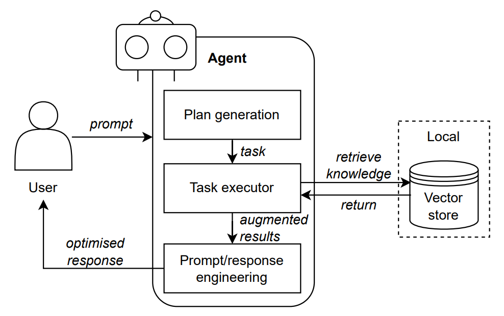

RAG is a technique for enhancing the accuracy and reliability of agents with facts retrieved from other sources (internal or online data). The knowledge gaps where the agents are lacking in memory are filled using the parameterised knowledge generated in vector databases. For instance, after plan generation, specific tasks may require information that is not within the original agent memory. The agent can hence retrieve information from the parameterised knowledge and use for task completion, while the augmented responses will be returned back to the user after optimisation. In particular, the implementation of RAG consists of the following steps: (i) Determine the data sources. (ii) Define the data structure for indexing raw data (i.e., text, image, video and audio) into embeddings or knowledge graphs. (iii) Given a certain query, task executor encodes this query and searches the knowledge base (e.g., vector store) to retrieve the most relevant information. (iv) Task executor processes the obtained data through reranking and filtering to produce a more informed and accurate response. The retrieval process requires zero pretraining or fine-tuning of the model served by the agent which preserves the data privacy of local data, reduces training and computation costs, and also provides up-todate and more precise information required. The retrieved local data can be sent back to the agent via prompts (need to consider the context window size), whereas the agent is able to process the information and generate plans via in-context learning. Currently there is a cluster of RAG techniques focusing on various enhancement aspects, data sources and applications, for instance, federated RAG, graph RAG, etc. Further, Retrieval Interleaved Generation can be considered a related technique of RAG where the agent can dynamically access external knowledge throughout the response generation phase.

| Facts | Notes |
| --- | --- |
| Summary: | Retrieval augmented generation techniques enhance the knowledge updatability of agents for goal achievement, and maintain data privacy of on-premise LLM-based agents/systems implementations.
| Context: | LLM-based agents are not equipped with knowledge related to explicitly specific domains, especially on highly confidential and privacy-sensitive local data, unless they are fine-tuned for pre-trained using domain data.|
| Problem: | Given a task, how can agents conduct reasoning with data/knowledge that are not learned by the LLMs through model training? |
| Forces: | - Lack of knowledge. The reasoning process may be unreliable when the agent is required to accomplish domain-specific tasks that the agent has no such knowledge reserve.   - Overhead. Fine-tuning large LLM using local data or training a large LLM locally consumes high amount of computation and resource costs.   - Data Privacy. Local data are confidential to be used to train or fine-tune the models.
| Benefits: | - Knowledge retrieval. Agents can search and retrieve knowledge related to the given tasks, which ensures the reliability of reasoning steps.   - Updatability. The prompts/responses generated using RAG by the agent on internal or online data are updatable by the complimentary parameterised knowledge.   - Data privacy. The agent can retrieve additional knowledge from local datastores, which ensures data privacy and security.   Cost-efficiency. Under the data privacy constraint, RAG can provide essential knowledge to the agent without training a new LLM entirely. This reduced the training costs. |
| Drawbacks: | - Maintenance overhead. Maintenance and update of the parameterised knowledge in the vector store requires additional computation and storage costs.   - Data limitation. The agents still mainly rely on the data it has been trained on to generate prompts. This can impact the quality and accuracy of the generated content in those specific domains.
| Related patterns: | Retrieval augmented generation can complement all other patterns by providing extra context information from the local datastore.
| Examples: | - Linkedin applies RAG to construct the pipeline of LLM based agents, which can search appropriate Womancase studies to respond users.|

### One-Shot Model Querying Design Pattern

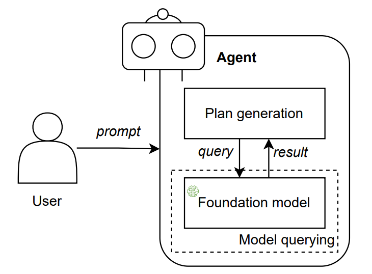

With one-shot model query. In this scenario, the agent queries the incorporated LLM to generate a corresponding plan based on user-specified goals and constraints. The LLM is only queried for once in regard to the user’s requirements (e.g. limited budget), to comprehend the provided inputs. In this manner, the agent can devise a multi-step plan to achieve a broad goal, and provide a holistic explanation for this plan without delving into detailed reasoning steps. Please note that this pattern is applicable when other components query the integrated LLM.

| Facts | Notes |
| --- | --- |
| Summary: | The LLM is accessed in a single instance to generate all necessary steps for the plan. |
| Context: | When users interact with the agent for specific goals, the included LLM is queried for plan generation. |
| Problem: | How can the agent generate the steps for a plan efficiently? |
| Forces: | - Efficiency. For certain pressing tasks, the agent should be able to conduct planning and respond in a short amount of time.   - Overhead. Users need to pay for each interaction with commercial LLMs. |
| Benefits: | - Efficiency. The agent can generate a plan to achieve users’ goals by querying the underlying LLM only once, which saves consumed time.   - Cost-efficiency. Users’ expenses can be reduced since the LLM is queried for one time.   - Simplicity. One-shot model querying can satisfy the tasks that do not require complex action plans.
| Drawbacks: | - Oversimplification. For complex tasks, one-shot model querying may not be able to fully capture all requirements at one time, hence oversimplifying the tasks and cannot return a correct response.   - Lack of explainability. One-shot model querying may suffer the lack of explainability as the incorporated LLM is queried only once, which may not provide detailed reasoning steps for plan generation.   - Size of the context window. The response quality may be constrained considering the LLMs’ current capability of handling long conversational contexts and the token limits. |
| Related patterns: | - Incremental model querying. Incremental model querying can be regarded an alternative of one-shot model querying with iteration.   - Single-path plan generator. One-shot model querying enables the generation of single-path plans by only querying the LLM for one time.  - Multimodal guardrails. Multimodal guardrails serve as an intermediate layer, managing the inputs and outputs of model querying.|
| Examples: | One-shot model querying can be considered configuration or use by default when a user is leveraging a LLM, while CoT and Zero-shot-CoT both exemplify this pattern |

### Incremental Model Querying Design Pattern

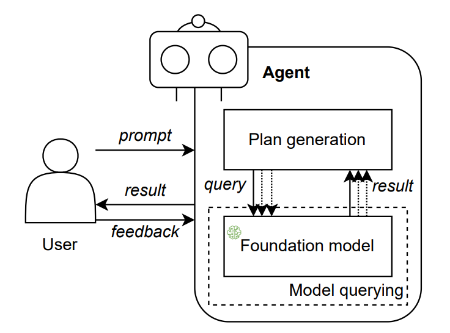

With incremental model querying, the agent could engage in a step-by-step reasoning process to develop the plan for goal achievement with multiple queries to the LLM. Meanwhile, human feedback can be provided at any time to both the reasoning process and generated plan, and adjustments can be made accordingly during model querying. The number of queries can be predefined in agent configuration or determined in user prompts. Please note that incremental model querying can rely on a reusable template, which guides the process through context injection or an explicit workflow/plan repository and management system. This pattern is applicable when other components query the integrated LLM.

| Facts | Notes |
| --- | --- |
| Summary: | Incremental model querying involves accessing the LLM at each step of the plan generation process. |
| Context: | When users interact with the agent for specific goals, the included LLM is queried for plan generation. |
| Problem: | The LLM may struggle to generate the correct response at the first attempt. How can the agent conduct an accurate reasoning process?
| Forces: | - Size of the context window. The context window of a LLM may be limited, hence users may not be able to provide a complete and comprehensive prompt.   - Oversimplification. The reasoning process may be oversimplified and hence endure uncertainties with only one attempt of model querying.   - Lack of explainability. The generated responses of LLMs require detailed reasoning process to preserve explainability and eventual trustworthiness. |
| Benefits: | - Supplementary context. Incremental model querying allows users to split the context in multiple prompts to address the issue of limited context window.   - Reasoning certainty. LLMs will iteratively refine the reasoning steps by self-checking or feedback from users.   - Explainability. Users can query the LLM to provide detailed reasoning steps through incremental model querying. |
| Drawbacks: | - Overhead. (i) Incremental model querying requires multiple interactions with the LLM, which may increase the time consumption for planning determination. (ii) The high volume of user queries may be cost-intensive when utilising commercial LLMs. |
| Related patterns: | - One-shot model querying. Incremental model querying can be regarded an alternative of one-shot model querying with iteration.   - Multi-path plan generator. The agent can capture users’ preferences at each step and generate multi-path plans by iteratively querying the LLM.   - Self-reflection. Self-reflection requires agents to query their incorporated LLM multiple times for response review and evaluation.   - Human-reflection. Human-reflection is enabled by incremental model querying for iterative communication between users/experts and the agent.   - Multimodal guardrails. Multimodal guardrails serve as an intermediate layer, managing the inputs and outputs of model querying.
| Examples: | - The underlying LLM of HuggingGPT is queried multiple times to decompose users’ requests into finegrained tasks, and then determine the dependencies and execution orders of tasks.   - EcoAssistant applies a code executor interacting with the LLM to iteratively refine code.   - ReWOO queries the LLM to (i) generate a list of interdependent plans, and; (ii) combine the observation evidence fetched from tools with the corresponding task. |

### Single-Path Plan Generator Design Pattern

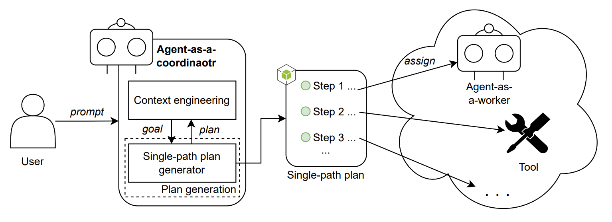

With single-path plan generator, after receiving and comprehending users’ goals, the single-path plan generator can coordinate the creation of a plan for other agents or tools and prioritise the tasks, to progressively lead towards goal accomplishment. Specifically, the plan generation process requires inference and reasoning that whether intermediate steps are actionable and optimal. Each step in this process is designed to have only a single subsequent step, forming a linear and direct plan, such as Chain-of-Thought (CoT). Self-consistency is employed to confirm with the LLM several times and select the most consistent answer as the final decision. Please note that the generated plan may have different granularity based on the given goal that complex plans may incorporate multiple workflows, processes, tasks and fine-grained steps.

| Facts | Notes |
| --- | --- |
| Summary: | Single-path plan generator orchestrates the generation of intermediate steps leading to the achievement of the user’s goal. |
| Context: | A agent is considered ‘black box’ to users, while users may care about the process of how an agent achieve users’ goals. |
| Problem: | How can an agent efficiently formulate the strategies to achieve users’ goals? |
| Forces: | - Underspecification. Users may assign tasks with high-level abstraction, which may be challenging for agents to handle the uncertainty or ambiguity in the provided context.   - Coherence. Users and other interacting tools/agents will expect coherent responses or guidelines for achieving certain goals.   - Efficiency. Uncertain decisions may affect the efficiency of an agent, which will result in reduced user satisfaction. |
| Benefits: | - Reasoning certainty. Single-path plan generator generates a multistep plan, which can reflect the reasoning process and mitigate the uncertainty or ambiguity for achieving users’ goals.   - Coherence. The interacting users, agents and tools are provided a clear and coherent path towards the ultimate goals.   - Efficiency. Single-path plan generator can increase efficiency in agents via pruning unnecessary steps or distractions.
| Drawbacks: | - Flexibility. A single-path plan may result in limited flexibility to accommodate diverse user preferences or application scenarios, hence users cannot customise their solutions.   - Oversimplification. The agent may oversimplify the generated plan which requires multi-faceted approaches. |
| Related patterns: | - One-shot model querying. One-shot model querying enables the generation of single-path plans by only querying the LLM for one time.   - Multi-path plan generator. Multi-path plan generator can be regarded an alternative of single-path plan generator for customised strategy.   - Self-reflection. Single-path plan generator and self-reflection both contribute to self-Consistency with Chain of Thought.
| Examples: | - LlamaIndex fine-tunes a ReAct Agent to achieve better performance with single-path plan generator via CoT.   - ThinkGPT provides a toolkit to facilitate the implementation of single-path plan generator pattern. |

### Multi-Path Plan Generator Design Pattern

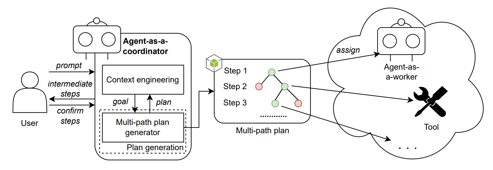

Based on single-path plan generator, multi-path plan generator can create multiple choices at each step towards the achievement of goals, which requires the underlying LLM to tease out the eligible and actionable activities for each choice in the previous step. Specifically, users’ preferences may influence the subsequent intermediate steps, leading to different eventual plans. The employment of involved agents and tools will be adjusted accordingly. Tree-of-Thoughts exemplifies this design pattern.

| Facts | Notes |
| --- | --- |
| Summary: | Multi-path plan generator allows for creating multiple choices at each intermediate step leading to achieving users’ goals. |
| Context: | A agent is considered ‘‘black box’’ to users, while users may care about the process of how an agent achieve users’ goals. |
| Problem: | How can an agent generate a high-quality, coherent, and efficient solution considering inclusiveness and diversity when presented with a complex task or problem? |
| Forces: | - Underspecification. Users may assign tasks with high-level abstraction, which may be challenging for agents to handle the uncertainty or ambiguity in the provided context.   - Coherence. Users and other interacting tools/agents will expect coherent responses or guidelines for achieving certain goals.   - Alignment to human preference. Certain goals require agents to capture users’ preferences, to provide customised solutions.   - Oversimplification. For particular complex tasks, agents may oversimplify the reasoning process, hence the provided solutions cannot satisfy users’ requirements. |
| Benefits: | - Reasoning certainty. Multi-path plan generator can generate a plan with multiple choices of intermediate steps to resolve the uncertainty or ambiguity within reasoning process.   - Coherence. The interacting users, agents and tools are provided a clear and coherent path towards the ultimate goals.   - Alignment to human preference. Users can confirm each intermediate step to finalise the planning, hence human preferences are absorbed in the generated customised strategy.   - Inclusiveness. The agent can specify multiple directions in the reasoning process for complex tasks. |
| Drawbacks: | - Overhead. Task decomposition and multi-plan generation may increase the communication overhead between the user and agent. |
| Related patterns: | - Incremental model querying. The agent can capture users’ preferences at each step and generate multi-path plans by iteratively querying the LLM.   - Single-path plan generator. Multi-path plan generator can be regarded an alternative of single-path plan generator for customised strategy.   - Human-reflection. Multi-plan generator creates plans with various directions, and human-reflection can help finalise the plan with user feedback to determine the choice of each intermediate step.
| Examples | - AutoGPT can make informed decisions by incorporating Tree-of-Thoughts as the multi-path plan generator.   - For a task, Gemini can generate multiple choices for users to decide. Upon receiving users’ responses, Gemini will provide multiple choices for the next step.   - Open AI GPT-4 was leveraged to implement a multi-path plan generator based on Tree-of-Thoughts. |

### Reflection Design Pattern

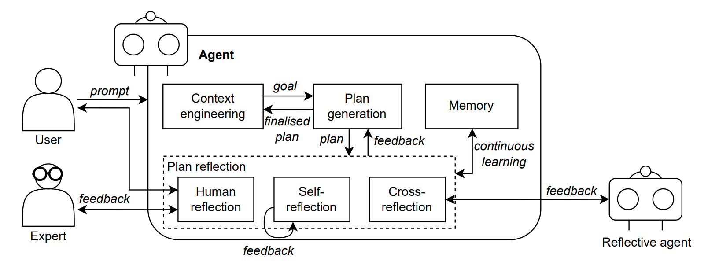

#### Self-reflection

Reflection is an optimisation process formalised to iteratively review and refine the reasoning process and generated contents of the agent. The user prompts specific goals to the agent, which then generates a plan to accomplish users’ requirements. Subsequently, the user can instruct the agent to reflect on the plan and the corresponding reasoning process. The agent will backtrack the inference process to verify whether certain intermediate results are incorrect and hence misleading all subsequent steps, then adjust and align its reasoning process to create a refined plan accordingly. Such reflection processes and results can be saved in the agent’s memory for continuous learning. The finalised plan will be carried out step by step. Self-consistency exemplifies this pattern.

| Facts | Notes |
| --- | --- |
| Summary: | Self-reflection enables the agent to generate feedback on the plan and reasoning process and provide refinement guidance from themselves. |
| Context: | Given users’ goals and requirements, the agent will generate a plan to decompose the goals into a set of tasks for achieving the goals. |
| Problem: | A generated plan may be affected by hallucinations of the LLM, how to review the plan and reasoning steps and incorporate feedback efficiently? |
| Forces: | - Reasoning uncertainty. There may be inconsistencies or uncertainties embedded in the agent’s reasoning process, affecting the task success rate and response accuracy.   - Lack of explainability. The trustworthiness of the agent can be disturbed by the issue of transparency and explainability of how the plan is generated.   - Efficiency. Certain goals require the plan to be finalised within a specific time period. |
| Benefits: | - Reasoning certainty. Agents can evaluate their own responses and reasoning procedure to check whether there are any errors or inappropriate outputs, and make refinement accordingly.   - Explainability. Self-reflection allows the agent to review and explain its reasoning process to users, facilitating better comprehension of the agent’s decision-making process.   - Continuous improvement. The agent can continuously update the memory or knowledge base and the manner of formalising the prompts and knowledge, to provide more reliable and coherent output to users without or with fewer reflection steps.   - Efficiency. On one hand, it is time-saving for the agent to selfevaluate its response, as no additional communication overhead is cost compared to other reflection patterns. On the other hand, the agent can provide more accurate responses in the future to reduce the overall reasoning time consumption considering the continuous improvement. |
| Drawbacks: | - Reasoning uncertainty. The evaluation result is dependent on the complexity of self-reflection and the agent’s competence in assessing its generated responses.   - Overhead. (i) Self-reflection can increase the complexity of an agent, which may affect the overall performance. (ii) Refining and maintaining agents with self-reflection capabilities requires specialised expertise and development process. |
| Related patterns: | - Prompt/response optimiser. Self-reflection can be applied to assess and refine the output of prompt/response optimiser   - Incremental model query. Self-reflection requires agents to query their incorporated LLM multiple times for response review and evaluation.   - Single-path plan generator. Single-path plan generator and selfreflection both contribute to self-Consistency with Chain of Thought. |
| Examples | - Reflexion employs a self-reflection model which can generate nuanced and concrete feedback based on the success status, current trajectory, and persistent memory.   - A replanning module in Bidder agent utilises self-reflection to create new textual plans based on the auction’s status and new context information.   - Generative agents perform reflection two or three times a day, by first determining the objective of reflection according to the recent activities, then generating a reflection which will be stored in the memory stream. |

#### Cross-reflection

If an agent cannot generate accurate results or precise planning steps via reflecting its outputs, users can prompt the agent to query another agent which is specialised in reflection. The latter agent can review and evaluate the logged outputs and relevant reasoning steps of the original agent, and provide refinement suggestions. This process can be iterative until the reflective agent confirms the plan. In addition, multiple agents can be queried for reflection to generate comprehensive responses.

| Facts | Notes |
| --- | --- |
| Summary: | Cross-reflection uses different agents or LLMs to provide feedback and refine the generated plan and corresponding reasoning procedure. |
| Context: | The agent generates a plan to achieve users’ goals, while the quality of this devised plan should be assessed. |
| Problem: | When an agent has limited capability and cannot conduct reflection with satisfying performance, how to evaluate the output and reasoning steps of this agent? |
| Forces: | - Reasoning uncertainty. The inconsistencies and errors in the agent’s reasoning process may reduce response accuracy and affect the overall trustworthiness.  - Lack of explainability. The trustworthiness of the agent can be disturbed by the issue of transparency and explainability of how the plan is generated.   - Limited capability. An agent may not be able to perform reflection well due to its limited capability and the complexity of self-reflection. |
| Benefits: | - Reasoning certainty. The agent’s outputs and respective methodology are assessed and refined by other agents to ensure the reasoning certainty and response accuracy.   - Explainability. Multiple agents can be employed to review the reasoning process of the original agent, providing thorough explanations to the user.   - Inclusiveness. The reflective feedback includes different reasoning outputs when multiple agents are queried, which can help formalise a comprehensive refinement suggestion.   - Scalability. Cross-reflection supports scalable agent-based systems as the reflective agents can be flexibly updated without disrupting the system operation. |
| Drawbacks: | - Reasoning uncertainty. The overall response quality and reliability are dependent on the performance of other reflective agents.   - Fairness preservation. When various agents participate in the reflection process, a critical issue would be how to preserve fairness among all the provided feedback.   - Complex accountability. If the cross-reflection feedback causes serious or harmful results, the accountability process may be complex when multiple agents are employed.   - Overhead. (i) There will be communication overhead for the interactions between agents. (ii) Users may need to pay for utilising the reflective agents. |
| Related patterns: | - Prompt/response optimiser. Cross-reflection can provide feedback to improve the output of prompt/response optimiser.   - Voting-based, role-based, and debate-based cooperation. Reflective agents can collaborate to evaluate an agent’s outputs in different cooperation schemes.   - Tool/agent registry. The agent can search reflective agents for cross-reflection via tool/agent registry. |
| Examples: | - XAgent the tool agent can send feedback and reflection to the plan agent to indicate whether a task is completed, or pinpoint the refinements.   - A thinker agent can provide suggestions to an actor agent, who is responsible for decisionmaking.   - Qian et al develop a virtual software development company based on agents, where the tester agents can detect bugs and report to programmer agents.   - The inter-agent feedback which involves criticism of each other, which can help agents adapt their strategies. |

#### Human reflection

When a user prompts his/her goals and specified constraints, the agent first creates a plan consisting of a series of intermediate steps. The constructed plan and its reasoning process logs can be presented to the user for review, or sent to other human experts to validate the feasibility and usefulness. The user or expert can provide comments or suggestions to indicate which steps can be updated or replaced. The plan will be iteratively assessed and improved until it is approved by the user/expert.

| Facts | Notes |
| --- | --- |
| Summary: | The agent collects feedback from humans to refine the plan, to effectively align with the human preference. |
| Context: | Agents create plans and strategies that decompose users’ goals and requirements into a pool of tasks. The tasks will be completed by other tools and agents. |
| Problem: | How to ensure human preference is fully and correctly captured and integrated into the reasoning process and generated plans? |
| Forces: | - Alignment to human preference. Agents are expected to achieve users’ goals ultimately, consequently, it is critical for agents to comprehend users’ preferences.   - Contestability. If the agent’s outputs do not satisfy users’ requirements and will cause negative impacts, there should be a timely process for users to contest the responses of agent. |
| Benefits: | - Alignment to human preference. The agent can directly receive feedback from users or additional human experts to understand human preferences, and improve the outcomes or procedural fairness, diversity in the results, etc.   - Contestability. Users or human experts can challenge the agent’s outcomes immediately if abnormal behaviours or responses are found.   - Effectiveness. Human-reflection allows agents to include users’ perspectives for plan refinement, which can help formalise responses tailored to users’ specific needs and level of understanding. This can ensure the usability of strategies, and improve the effectiveness for achieving users’ goals. |
| Drawbacks: | - Fairness preservation. The agent may be affected by users who provide skewed information about the real world.   - Limited capability. Agents may still have limited capability to understand human emotions and experiences.   - Underspecification. Users may provide limited or ambiguous reflective feedback to agents.   - Overhead. Users may need to pay for the multiple rounds of communication with the agent. |
| Related patterns: | - Prompt/response optimiser. Human-reflection can provide human preference and suggestions to improve the generated prompts and responses.   - Multi-path plan generator. Multi-plan generator creates plans with various directions, and human-reflection can help finalise the plan with user feedback to determine the choice of each intermediate step.   - Incremental model querying. Human-reflection is enabled by incremental model querying for iterative communication between users/experts and the agent. |
| Examples: | - Inner Monologue is implemented in a robotic system, which can decompose users’ instructions into actionable steps, and leverage human feedback for object recognition.   - Users and agents both need to provide related evidence and arguments for their conflicting opinions.   - incorporate human feedback for agents to capture the dynamic evolution of user interests and consequently provide more accurate recommendations. |

### Voting-Based Cooperation Design Pattern

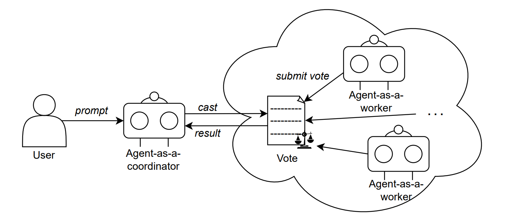

Agents can cooperate to finalise a decision via votes. Specifically, an agent can first generate a candidate response to the user’s prompts, then it holds a vote in which different reflective suggestions are presented as choices. Additional agents are requested to submit their votes to select the most appropriate feedback according to their capabilities and experiences. In this circumstance, agents communicate in a centralised manner that the original agent will act as a coordinator. The voting result will be formalised and sent back to the original agent, who can refine the response accordingly before answering the user. Please note that the voting process can be implemented through various methods, e.g., direct communications between the agent-as-a-coordinator and other agents, blockchain-based smart contracts, etc. Moreover, the identity management of all participating agents is significant to ensure the traceability and verifiability of votes.

| Facts | Notes |
| --- | --- |
| Summary: | Agents can freely provide their opinions and reach consensus through voting-based cooperation. |
| Context: | Multiple agents can be leveraged within a compound AI system. Agents need to collaborate on the same task while having their own perspectives. |
| Problem: | How to finalise the agents’ decisions properly to ensure fairness among different agents? |
| Forces: | - Diversity. The employed agents can have diverse opinions of how a plan is constructed or how a task should be completed.   - Fairness. Decision-making among agents should take their rights and responsibilities into consideration to preserve fairness.   - Accountability. The behaviours of agents should be recorded to enable future auditing if any violation is found in the collaboration outcomes. | 
| Benefits: | - Fairness. Votes can be held in multiple ways to preserve fairness. For instance, counting heads to ensure agents’ rights are equal, or weights can be distributed considering the roles of agents, etc.   - Accountability. The overall procedure and final results are recorded in the respective voting system. Stakeholders can trace back to identify the accountable agents selecting certain options.   - Collective intelligence. The finalised decisions  after votes can leverage the strengths of multiple agents (e.g. comprehensive knowledge base), hence they are regarded as more accurate and reliable  than the ones generated by a single agent. |
| Drawbacks: | - Centralisation. Specific agents may gain the majority of decision rights and hence have the ability to compromise the voting process.   - Overhead. Hosting a vote may increase the communication overhead for agents to examine and vote for the choices. | 
| Related patterns: | - Cross-reflection. An agent can query multiple agents to provide feedback, which can be determined via voting-based cooperation between the reflective agents.   - Role-based and debate-based cooperation. Voting-based cooperation can be regarded as an alternative to other cooperation patterns by hosting a vote between agents, whilst they can be applied together to complement each other.   - Tool/agent registry. Agents participating in the voting process can be employed via tool/agent registry. |
| Examples: | - Hamilton utilises nine agents to simulate court where the agents need to vote for the received cases. Each case is determined by the dominant voting result.   - ChatEval Agents can reach consensus on users’ prompts via voting, while the voting results can be totalled by calculating either the majority vote or the average score.    - Yang explore the alignment of agent voters based on GPT-4 and LLaMA-2 and human voters on 24 urban projects. The results indicate that agent voters tend to have uniform choices while human voters have diverse preferences.   - Li incrementally query a LLM to generate 𝑁 samples, and leverage multiple agents to select a finale response via majority voting. |

### Role-Based Cooperation Design Pattern

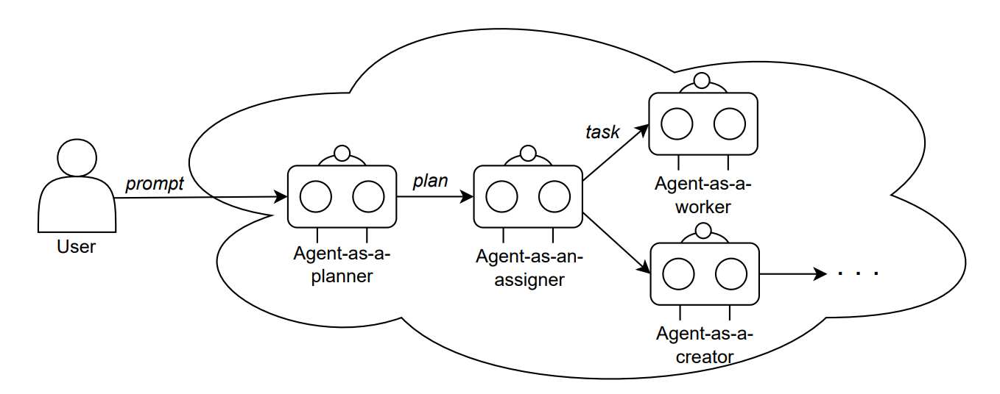

Role-based cooperation, where agents coordinate in a hierarchical scheme. In particular, agents can be assigned certain roles and hence establishing a workflow via persona specification, task definition, tool employment, and process orchestration. For example, an agent-as-aplanner can generate a multi-step plan by decomposing user’s goal into a chain of tasks. Subsequently, the agent-as-an-assigner can orchestrate task assignment, i.e., some tasks can be completed by the assigner itself, while other tasks can be delegated to certain agent-as-a-worker based on their domain-specific capabilities and expertise. In addition, if there is no available agent, agent-as-a-creator can be invoked to create a new agent with a specific role, by providing necessary resources, clear objectives and initial guidance to ensure a seamless transition of tasks and responsibilities. Please note that more elaborate roles can be defined and assigned to the agents.

| Facts | Notes |
| --- | --- |
| Summary: | Agents are assigned assorted roles and decisions are finalised in accordance with their roles. |
| Context: | Multiple agents can be leveraged within a compound AI system. Agents need to collaborate on the same task while having their own perspectives. |
| Problem: | How can agents cooperate on certain tasks considering their specialties? |
| Forces: | - Diversity. The employed agents can have diverse opinions of how a plan is constructed or how a task should be completed.   - Division of abour. As agents can be trained with different corpus for various purposes, their strengths and expertise should be taken into consideration for task completion.   - Fault tolerance. Agents may be unavailable during cooperation, which will affect the eventual task result. |
| Benefits: | - Division of labour. Agents can simulate the division of labour in the real world according to their roles, which enables the observation of social phenomena.   - Fault tolerance. Since multiple agents are leveraged, the system can continue operation by replacing inactive agents with other agents of the same role.   - Scalability. Agents of new roles can be employed or created anytime to refine the task workflow and extend the capability of the whole system.   - Accountability. Accountability is facilitated as the responsibilities of agents are attributed clearly regarding their expected roles. |
| Drawbacks: | - Overhead. Cooperation between agents will increase communication overhead, while agent services with different roles may have different prices. | 
| Related patterns: | - Cross-reflection. An agent can query multiple agents to provide feedback, which can be determined via role-based cooperation between the reflective agents.   - Voting-based and debate-based cooperation. Role-based cooperation can be regarded as an alternative of other cooperation patterns by clearly assigning roles to agents, which will then work and collaborate according to the given roles. Whilst, these patterns can be applied together to complement each other.   - Tool/agent registry. Agents with different roles can be searched and employed via tool/agent registry. |
| Examples: | - XAgent consists of three main parts: planner agent for task generation, dispatcher agent for task assignment, and tool agent for task completion.   - MetaGPT utilises various agents acting as different roles (e.g., architect, project manager, engineer) in standardised operating procedures.   - MedAgents Agents are assigned roles as various domain experts (e.g. cardiology, surgery, gastroenterology) to provide specialised analysis and collaboratively work on healthcare issues.   - Wang et al propose Mixture-of-Agents where proposer agents provide useful reference responses to aggregator agents, and the aggregator agents are composed in layers to synthesise and refine the responses. |

### Debate-Based Cooperation Design Pattern

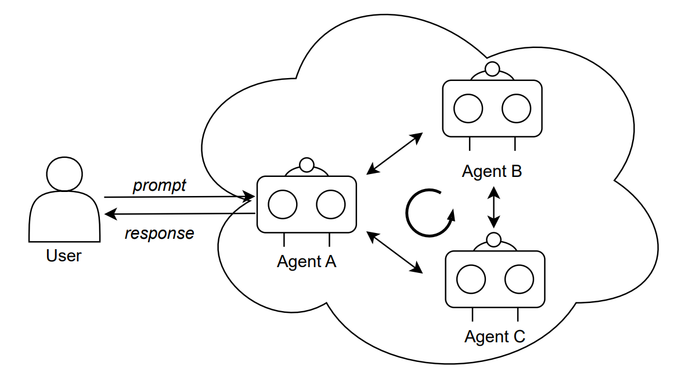

With debate-based cooperation, a user can send queries to an agent, which will then share the questions with other agents. Given the shared question, each agent generates its own initial responses, and subsequently, a round of debate will start between the agents. Agents will propagate their initial response in a decentralised manner to each other for verification, while also providing instructions and potential directions to construct a more comprehensive response based on inclusive and collective outcomes. In addition, agents may utilise a shared memory in certain circumstances, or allow each other to access the respective memory for facilitating the debate. This debate process can be iterative to enhance the performance of all participating agents. Debate-based cooperation can end according to a predefined number of debate rounds, or the agents will continue the procedure until a consensus answer is obtained.

| Facts | Notes |
| --- | --- |
| Summary: | An agent receives feedback from other agents, and adjusts the thoughts and behaviours during the debate with other agents until a consensus is reached. | 
| Context: | A compound AI system can integrate multiple agents to provide more comprehensive services. The included agents need to collaborate on the same task while having their own perspectives. | 
| Problem: | How to leverage multiple agents to create refined responses, while facilitating the evolution of agents. |
| Forces: | - Diversity. Different agents may have various opinions to help refine the generated responses to users.   - Lack of adaptability. An agent may exhibit limited creativity in reasoning and response generation when given new context or tasks.   - Lack of explainability. The interaction process of agents should be interpreted for auditing if violations are detected. |
| Benefits: | - Adaptability. Agents can adapt to other agents during the debate procedure, achieving continuous learning and evolution.   - Explainability. Debate-based cooperation is structured with agents’ arguments and presented evidence, preserving transparency and explainability of the whole procedure.   - Critical thinking. Arguing with other agents can help an agent develop the ability of critical thinking for future reasoning process. | 
| Drawbacks: | - Limited capability. The effectiveness of debate-based cooperation relies on agents’ capabilities of reasoning, argument, and evaluation of other agents’ statement.   - Data privacy. Agents may need to withhold certain sensitive information, which can affect the debate process.   - Overhead. The complexity of debate may increase the communication and computation overhead.   - Scalability preservation. The system scalability may be affected as the number of participating agents increases. The coordination of agents and processing of their arguments may become complex. |
| Related patterns: | - Cross-reflection. Agents can decide the reflective feedback to another agent via debate-based cooperation.   - Voting-based and role-based cooperation. Debate-based cooperation can be regarded as an alternative of other cooperation patterns by hosting a debate between agents, whilst they can be applied together to complement each other.   - Tool/agent registry. Agents participating in the voting process can be employed via tool/agent registry.|
| Examples: | - crewAI provides a multi-agent orchestration framework where multiple agents can be grouped for discussion on a given topic.   - Liang leverage multi-agent debate to address the issue of ‘‘Degeneration-of-Thought’’. Within the debate, an agent needs to persuade another and correct the mistakes.   - Du employ multiple agents to discuss the given user input, and the experiment results indicate that the agents can converge on a consensus answer after multiple rounds.   - Chen explore the negotiation process in a multiagent system, where each agent can perceive the outcomes of other agents, and adjust its own strategies.   - Li propose a framework including peer rank and discussion between agents, to mitigate the biases in automated evaluation process. |

### Multimodal Guardrails Design Pattern

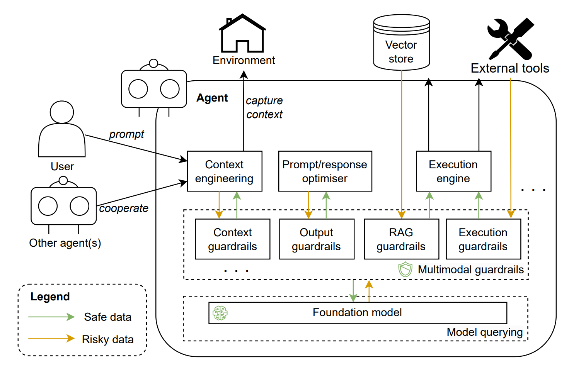

Guardrails can be applied as an intermediate layer between the LLM and all other components in a compound AI system. When users input prompts or other components (e.g. memory) send any message to the LLM, guardrails can first verify whether the information meets specific predefined requirements. Only valid information are delivered to the LLM, while risky or sensitive data will be processed before being transferred. For instance, personally identifiable information should be treated with care or removed to protect privacy. Guardrails can evaluate the contents either relying on predefined examples, or in a ‘‘reference-free’’ manner. Equivalently, when the LLM creates results, guardrails need to ensure that the responses do not include biased or irrespective information to users, or fulfil the particular requirements of other system components. Please note that a set of guardrails can be implemented where each of them is responsible for specialised interactions, e.g., information retrieval from datastore, validation of users’ input, external API invocation, etc. Meanwhile, guardrails are capable of processing multimodal data such as text, audio, video to provide comprehensive monitoring and control.

| Facts | Notes |
| --- | --- |
| Summary: | Multimodal guardrails can control the inputs and outputs of LLMs to meet specific requirements such as user requirements, ethical standards, and laws. |
| Context: | An agent consists of LLM and other components. When users prompt specific goals to the agent, the underlying LLM is queried for goal achievement. | 
| Problem: | How to prevent the LLM from being influenced by adversarial inputs, or generate harmful or undesirable outputs to users and other components? |
| Forces: | - Robustness. Adversarial information may be sent to the LLM, which will affect the model’s memory and all subsequent reasoning processes and results.   - Safety. LLMs may generate inappropriate responses due to hallucinations, which can be offensive to users, and disturb the operation of other components (e.g., other agents, external tools).   - Standard alignment. Agents and the underlying LLMs should align with the specific standards and requirements in industries and organisations. |
| Benefits: | - Robustness. Guardrails preserve the robustness of LLMs by filtering the inappropriate context information.   - Safety. Guardrails serve as validators of LLM outcomes, ensuring the generated responses do not harm agent users.   - Standard alignment. Guardrails can be configured referring to organisational policies and strategies, ethical standards, and legal requirements to regulate the behaviours of LLMs.   - Adaptability. Guardrails can be implemented across various LLMs and agents, and deployed with customised requirements. | 
| Drawbacks: | - Overhead. (i) Collecting diverse and high-quality corpus to develop multimodal guardrails may be resource-intensive. (ii) Realtime processing multimodal data can increase the computational requirements and costs.   - Lack of explainability. The complexity of multimodal guardrails makes it difficult to explain the finalised outputs. |
| Related patterns: | - Proactive goal creator. Multimodal guardrails can help process the multimodal data captured by proactive goal creator.   - One-shot and incremental model querying. Multimodal guardrails serve as an intermediate layer, managing the inputs and outputs of model querying. |
| Examples: | - NVIDIA released NeMo guardrails, which are specifically designed to ensure the coherency of dialogue between users and AI systems, and prevent negative impact of misinformation and sensitive topics.   - Meta published Llama guard, a LLM based safeguard model fine-tuned via a safety risk taxonomy. Llama guard can identify the potentially risky or violating content in users’ prompts and model outputs.   - Guardrails AI Guardrails AI provides a hub, listing various validators for handling different risks in the inputs and outputs of LLMs. |

### Tool/Agent Registry Design Pattern

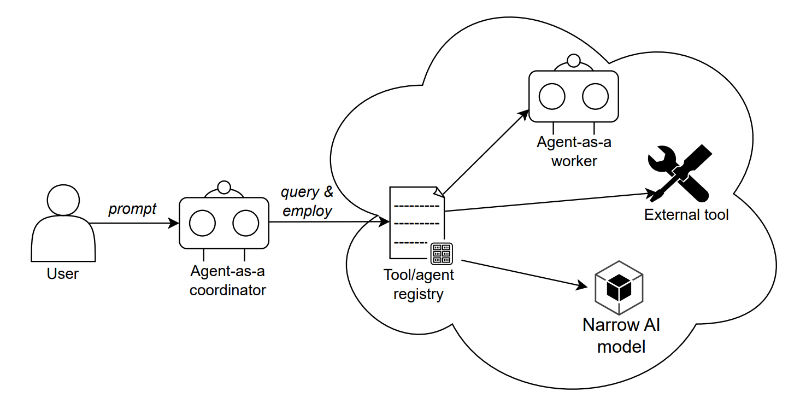

A user prompts goals to an agent, which then decomposes the goals into fine-grained tasks. The agent can query the tool/agent registry, which is the main entry point for collecting and categorising various tools and agents regarding a series of metrics (e.g., domain-specific capability, price, context window). Based on the returned information, the agent can employ and assign the tasks to respective tools and agents. Please note that a registry can be implemented in different manners, for instance, a coordinator agent with specific knowledge base, blockchain-based smart contract, etc., and a registry can be extended into a marketplace for tool/agent service trading.

| Facts | Notes |
| --- | --- |
| Summary: | The tool/agent registry maintains a unified and convenient source to select diverse agents and tools. | 
| Context: | Within an agent, the task executor may cooperate with other agents or leverage external tools for expanded capabilities. |
| Problem: | There are diverse agents and tools, how can the agent efficiently select the appropriate external agents and tools? |
| Forces: | - Discoverability. It may be difficult for users and agents to discover the available agents and tools considering the diversity.   - Efficiency. Users/agents need to finalise agent and tool selection within a certain time period.   - Tool appropriateness. Particular tasks may have specific requirements of agents/tools (e.g. certain capabilities). |
| Benefits: | - Discoverability. The registry provides a catalogue for users and agents to discover tools and agents with different capabilities.   - Efficiency. The registry offers an intuitive inventory listing the attributes (e.g., performance, price) of tools and agents, which saves time for comparison.   - Tool appropriateness. Given the task requirements and conditions, users and agents can select the most appropriate tools/agents according to the provided attributes.   - Scalability. The registry only stores certain metadata about tools and agents, hence the data structure is simple and lightweight, which ensures the scalability of the registry. |
| Drawbacks: | - Centralisation. The registry may become a vendor lock-in solution and cause single point of failure. It may be manipulated and compromised if it is maintained by external entities.   - Overhead. Implementing and maintaining a tool/agent registry can introduce additional complexity and overhead. | 
| Related patterns: | - Cross-reflection. The agent can search reflective agents for crossreflection via tool/agent registry.   - Voting-based, role-based and debate-based cooperation. Tool/agent registry can provide a source of agents for the cooperation patterns.   - Agent adapter. Tool/agent registry records the available external tools, while agent adapter can convert the interface of selected tools into agent-friendly format. |
| Examples: | - GPTStore provides a catalogue for searching ChatGPT-based agents.   - TPTU incorporates a toolset to broaden the capabilities of AI Agents.   - VOYAGER can store action programs and hence incrementally establish a skill library for reusability.   - OpenAgents is specifically developed to manage the API invocation of plugins. |

### Agent Adapter Design Pattern

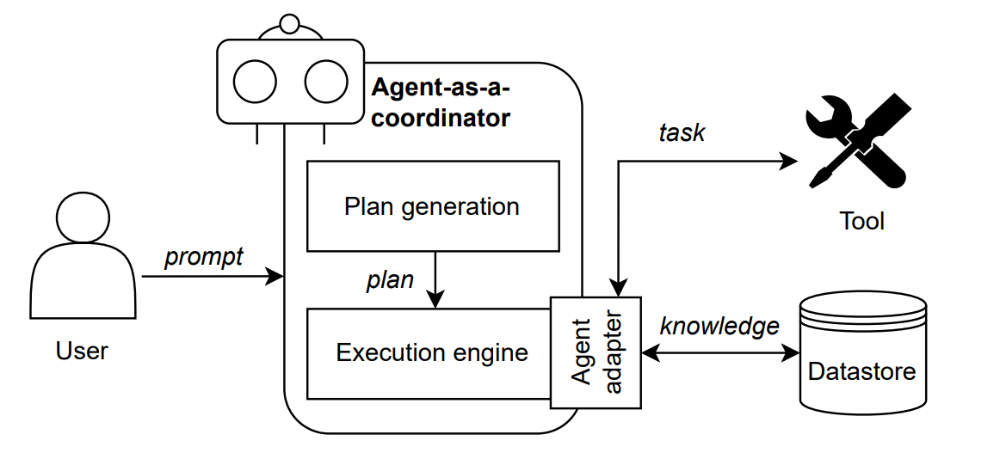

Given user’s instructions, the agent generates a plan consisting of a set of tasks to achieve the user’s goals. In particular, the agent may employ diverse external tools to complete different tasks. However, tools have respective interfaces, which can be of different abstraction levels for the agent to deal with, or have specific format requirements, etc. Agent adapter can help invoke and manage these interfaces by converting the agent messages into required format or content, and vice versa. In particular, the adapter can retrieve tool manual or tutorial from datastore, to acquire available interfaces and learn the usage. It then transforms the agent outputs based on the interface requirements and invokes the service. Please note that fine-grained interface description can enhance agent understanding and hence improve the performance. The adapter also receives execution results from tools, which will be sent to the underlying LLM for further analysis (e.g. task assignment to other tools, self-reflection for tool employment). For instance, the adapter can translate tasks into system messages when interacting with local file system, or capture and operate graphical user interface when playing a video game.

| Facts | Notes |
| --- | --- |
| Summary: | An agent adapter provides interface to connect the agent and external tools for task completion. |
| Context: | An agent may leverage external tools to complete certain tasks for expanded capabilities. |
| Problem: | The agent needs to deal with different interfaces of diverse tools, while certain interfaces might be incompatible or inefficient to interact for the agent. How can the agent assign tasks to external tools and process the results? |
| Forces: | - Interoperability. Certain tasks require external tools to complete, and the tools may need agents to process particular information during intermediate steps.   - Adaptability. Agents may employ new tools considering task complexity, tool capability, cost, etc.   - Overhead. Manual development of compatible interfaces for agents and external tools can be intensive and inefficient. |
| Benefits: | - Interoperability. Agent adapter facilitates the interoperation between an agent and external tools.   - Adaptability. Agents can employ new tools via agent adapter, which can acquire and convert the tool API via corresponding manual or tutorial.   - Reduced development cost. Agent adapter enables autonomous conversion of interfaces, there is no need to develop compatible interfaces for different tools, hence the development cost is reduced. |
| Drawbacks: | - Maintenance overhead. (i) Agent adapter itself requires proper maintenance and evaluation to ensure the correctness of outputs. (ii) Agent adapter may need additional memory or external data store to record the historical tool interfaces. | 
| Related patterns: | - Prompt/response optimiser. Prompt/response optimiser can improve users’ inputs, and the optimised prompts can be sent to other agents for goal achievement, while agent adapter focuses more on the utilisation of external tools.   - Tool/agent registry. Tool/agent registry records the available external tools, while agent adapter can convert the interface of selected tools into agent-friendly format. |
| Examples: | - AutoGen. Users can register different tools in the agent, specifying the usage description. Registered tools will be leveraged by the agent during a conversation with user.   - Apple Intelligence can support writing, image generation, schedule management across different products and applications. For instance, it can capture the entities in users’ photo library and create emoji.   - Semantic Kernel can orchestrate agents and plugins to extend agents’ skills. Plugins need to provide semantic description (e.g. input, output, side effects) for agents to understand.   SWE-agent can provide agent–computer interfaces, enabling LLM-based agents to process code commands and resolve software engineering tasks. |

### Agent Evaluator Design Pattern

Developers can deploy evaluator to assess the agent regarding responses and reasoning process at both design-time and runtime. Specifically, developers need to build up the evaluation pipeline, for instance, by defining specific scenario-based requirements, metrics and expected outputs from agents. Given particular context, the agent evaluator prepares context-specific test cases (either searching from external resources or generating by itself), and performs evaluation on the agent components respectively. The evaluation results provide valuable feedback such as boundary cases, near-misses, etc., while developers can further fine-tune the agent or employ corresponding risk mitigation solutions, and also upgrade the evaluator based on the results.

| Facts | Notes |
| --- | --- |
| Summary: | Agent evaluator can perform testing to assess the agent regarding diverse requirements and metrics. |
| Context: | Within an agent, the underlying LLM and a series of components coordinate to conduct reasoning and generate the responses given users’ prompts.| 
| Problem: | How to assess the performance of agents to ensure they behave as intended? |
| Forces: | - Functional suitability guarantee. Agent developers need to ensure that a deployed agent operates as intended, providing complete, correct, and appropriate services to users.   - Adaptability improvement. Agent developers need to understand and analyse the usage of agents in specific scenarios, to perform suitable adaptations. |
| Benefits: | - Functional suitability. Agent developers can learn the agent’s behaviour, and compare the actual responses with expected ones through the evaluation results.   - Adaptability. Agent developers can analyse the evaluation results regarding scenario-based requirements, and decide whether the agent should adapt to new requirements or test cases.   - Flexibility. Agent developers can define customised metrics and the expected outputs to test a specific aspect of the agent. |
| Drawbacks: | - Metric quantification. It is difficult to design quantified rubrics for the assessment of software quality attributes.   - Quality of evaluation. The evaluation quality is dependent on the prepared test cases. | 
| Related patterns: | Agent evaluator can be configured and deployed to assess the performance of other pattern-oriented agent components during both design-time and runtime. |
| Examples: | - Inspect, UK AI Safety Institute devised an evaluation framework for large language models that offers a series of built-in components, including prompt engineering, tool usage, etc.   - DeepEval incorporates 14 evaluation metrics, and supports agent development frameworks such as LlamaIndex, Hugging Face, etc.   - Promptfoo can provide efficient evaluation services with caching, concurrency, and live reloading, and also enable automate scoring based on user-defined metrics.   - Ragas facilitates evaluation on the RAG pipelines via test dataset generation and leveraging LLM-assisted evaluation metrics. |

## Pattern Categories and Summary
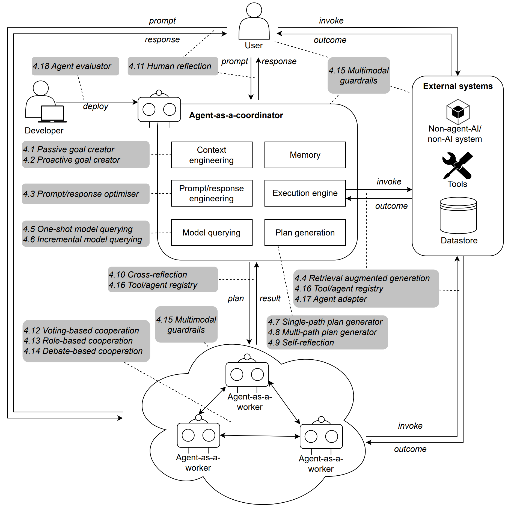

# Foundation Model-Based Agent Design Pattern Catalogue Overview

| **Pattern**                  | **Summary** |
|------------------------------|------------|
| **Passive goal creator** | Analyse users’ articulated prompts through the dialogue interface to preserve *interactivity, goal-seeking, and efficiency.* |
| **Proactive goal creator** | Anticipate users’ goals by understanding human interactions and capturing the context via relevant tools, to enhance *interactivity, goal-seeking, and accessibility.* |
| **Prompt/response optimiser** | Optimise the prompts/responses according to the desired input or output content and format to provide *standardisation, goal alignment, interoperability, and adaptability.* |
| **Retrieval augmented generation** | Enhance the knowledge *updatability* of the agents while maintaining *data privacy* of on-premise foundation model-based agents/systems implementations. |
| **One-shot model querying** | Access the foundation model in a single instance to generate all necessary steps for the plan for *cost efficiency and simplicity.* |
| **Incremental model querying** | Access the foundation model at each step of the plan generation process to provide *supplementary context, improve reasoning certainty and explainability.* |
| **Single-path plan generator** | Orchestrate the generation of intermediate steps leading to the achievement of the user’s goal to improve *reasoning certainty, coherence, and efficiency.* |
| **Multi-path plan generator** | Allow multiple choice creation at each intermediate step leading to achieving users’ goals to enhance *reasoning certainty, coherence, alignment to human preference, and inclusiveness.* |
| **Self-reflection** | Enable the agent to generate feedback on the plan and reasoning process and provide refinement guidance from themselves to improve *reasoning certainty, explainability, continuous improvement, and efficiency.* |
| **Cross-reflection** | Use different agents or foundation models to provide feedback and refine the generated plan and reasoning process for *better reasoning certainty, explainability, inclusiveness, and scalability.* |
| **Human reflection** | Collect feedback from humans to refine the plan and reasoning process, to effectively align with *human preference,* improving *contestability and effectiveness.* |
| **Voting-based cooperation** | Enable free opinions expression across agents and reach consensus by submitting their votes to preserve *fairness, accountability, and collective intelligence.* |
| **Role-based cooperation** | Assign assorted roles and finalize decisions in accordance with the roles of agents for facilitating *division of labor, fault tolerance, scalability, and accountability.* |
| **Debate-based cooperation** | Provide and receive feedback across multiple agents adjusting the thoughts and behaviors during the debate with other agents until a consensus is reached to improve *adaptability, explainability, and critical thinking.* |
| **Multimodal guardrails** | Control the inputs and outputs of foundation models to meet specific requirements such as user requirements, ethical standards, and laws to enhance *robustness, safety, standard alignment, and adaptability.* |
| **Tool/agent registry** | Maintain a unified and convenient source to select diverse agents and tools to improve *discoverability, efficiency, tool appropriateness, and scalability.* |
| **Agent adapter** | Provide an interface to connect the agent and external tools for task completion, ensuring *interoperability and adaptability,* and reducing *development cost.* |
| **Agent evaluator** | Perform testing to assess the agent regarding diverse requirements and metrics, ensuring *functional suitability, adaptability* with improved *flexibility.* |

## Pattern Selection and Adoption Strategy

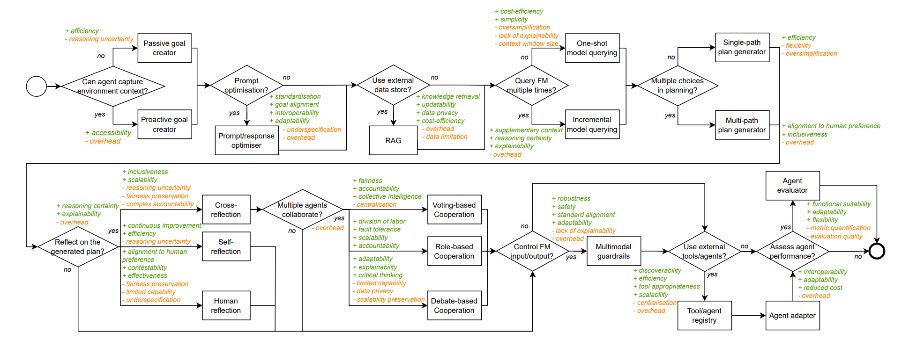

This is the selection process of different patterns for practitioners. In particular, for a design problem, each decision can map to the corresponding solution space, which is regarded as the alternative pattern(s) for those in the opposite decision’s solution space. Further, within the same solution space, there can be multiple patterns serving as complements of each other. The strengths and trade-offs of each pattern are highlighted in green and orange colour respectively. Please note that the decision model omits the common attributes for alternative patterns as either decision will incorporate these attributes as consequences, and it centralises the shared attributes for complementary patterns for brevity. In addition, there is no specific selection or application sequence, considering the patterns aim to facilitate the design and development of different architectural components, which can be implemented via a decoupling strategy. A brief explanation is provided as follows. If the agent is expected to capture users’ environmental information as supplementary context, proactive goal creator can be applied to analyse users’ goals based on the data captured by a series of sensors. In this case, the agent can also serve users with specified disabilities. Whilst, passive goal creator can provide a simple and efficient dialogue interface to interact with users. 

Prompt/response optimiser can enhance the goal alignment by refining users’ instructions into standardised prompts. Meanwhile, the agent can retrieve more information from external knowledge base via retrieval augmented generation whenever a component requires additional context. Besides, a component can query the incorporated foundation model for a single purpose multiple times (incremental model querying) based on either user-specified requirements or system configuration, to provide supplementary context and hence improving model reasoning certainty, or just query once (one-shot model querying ) due to limited budget for model calling. 

For a particular goal, agents can create a linear plan via single-path plan generator for efficiency, or a complex plan in which each step has different options via multi-path plan generator to ensure inclusiveness and alignment to human preferences. A generated plan can be assessed via multiple solutions (i.e. self-reflection, cross-reflection and human reflection) for ensuring plan correctness and feasibility, and improving agent reasoning certainty and explainability, while each solution has respective strengths and trade-offs. Further, multiple agents can be employed for reflection, and they can interact with each other in terms of voting-based, role-based and debate-based cooperation schemes. 

When the underlying foundation model is queried, malicious inputs can affect the reasoning process, and the model may continuously learn and generate skewed outputs. Multimodal guardrails can provide a layer between the foundation model and other components by inspecting the model inputs and outputs through both rule-based and AI-based examination. In case that external tools or agents are leveraged for certain tasks, a tool/agent registry can enhance discoverability, and ensure the efficiency and appropriateness of tools. Agent adapter guarantees the interoperability and adaptability of an agent to call external services whilst reducing the cost for manual development and maintenance. Finally, agent evaluator can be utilised to assess the agent’s functional suitability before release.
