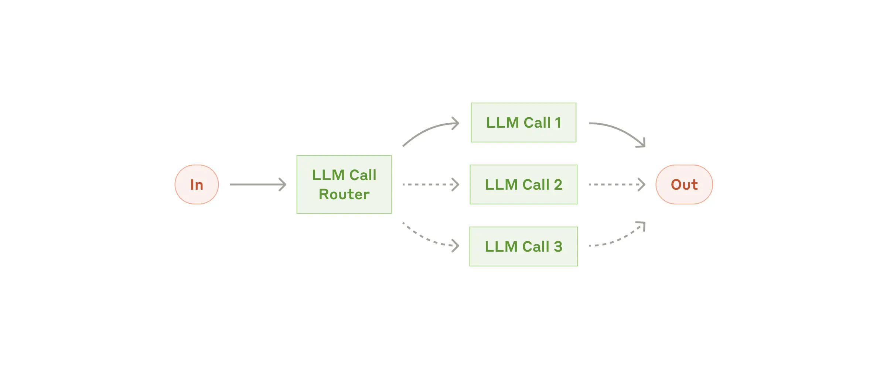

# Architecture of LLM-based AI Agents

## Conceptual Workflow Architecture
[Anthropic](https://www.anthropic.com/research/building-effective-agents) provides a clear architecture to explain the workflow architecture for LLM-based agents, and we will simply use this as a starting point. [LangChain](https://www.youtube.com/watch?v=aHCDrAbH_go) also provided examples on how to implement based on these architectures. 

### Workflow: Augumented LLM

LLM enhanced with augmentations such as retrieval, tools, and memory. Our current models can actively use these capabilities—generating their own search queries, selecting appropriate tools, and determining what information to retain.

While there are many ways to implement these augmentations, one approach is through our recently released Model Context Protocol, which allows developers to integrate with a growing ecosystem of third-party tools with a simple client implementation.

### Workflow: Prompt chaining

Prompt chaining decomposes a task into a sequence of steps, where each LLM call processes the output of the previous one. You can add programmatic checks (see "gate” in the diagram below) on any intermediate steps to ensure that the process is still on track.

This workflow is ideal for situations where the task can be easily and cleanly decomposed into fixed subtasks. The main goal is to trade off latency for higher accuracy, by making each LLM call an easier task.

### Workflow: Routing

Routing classifies an input and directs it to a specialized followup task. This workflow allows for separation of concerns, and building more specialized prompts. Without this workflow, optimizing for one kind of input can hurt performance on other inputs.

Routing works well for complex tasks where there are distinct categories that are better handled separately, and where classification can be handled accurately, either by an LLM or a more traditional classification model/algorithm.

### Workflow: Parallelization

LLMs can sometimes work simultaneously on a task and have their outputs aggregated programmatically. This workflow, parallelization, manifests in two key variations:
- Sectioning: Breaking a task into independent subtasks run in parallel.
- Voting: Running the same task multiple times to get diverse outputs.

Parallelization is effective when the divided subtasks can be parallelized for speed, or when multiple perspectives or attempts are needed for higher confidence results. For complex tasks with multiple considerations, LLMs generally perform better when each consideration is handled by a separate LLM call, allowing focused attention on each specific aspect.

### Workflow: Orchestrator-workers

In the orchestrator-workers workflow, a central LLM dynamically breaks down tasks, delegates them to worker LLMs, and synthesizes their results.
This workflow is well-suited for complex tasks where you can’t predict the subtasks needed (in coding, for example, the number of files that need to be changed and the nature of the change in each file likely depend on the task). Whereas it’s topographically similar, the key difference from parallelization is its flexibility—subtasks aren't pre-defined, but determined by the orchestrator based on the specific input.

### Workflow: Evaluator-optimizer

In the evaluator-optimizer workflow, one LLM call generates a response while another provides evaluation and feedback in a loop.

This workflow is particularly effective when we have clear evaluation criteria, and when iterative refinement provides measurable value. The two signs of good fit are, first, that LLM responses can be demonstrably improved when a human articulates their feedback; and second, that the LLM can provide such feedback. This is analogous to the iterative writing process a human writer might go through when producing a polished document.

### Workflow: Autonomous

Agents are emerging in production as LLMs mature in key capabilities—understanding complex inputs, engaging in reasoning and planning, using tools reliably, and recovering from errors. Agents begin their work with either a command from, or interactive discussion with, the human user. Once the task is clear, agents plan and operate independently, potentially returning to the human for further information or judgement. During execution, it's crucial for the agents to gain “ground truth” from the environment at each step (such as tool call results or code execution) to assess its progress. Agents can then pause for human feedback at checkpoints or when encountering blockers. The task often terminates upon completion, but it’s also common to include stopping conditions (such as a maximum number of iterations) to maintain control.

Agents can handle sophisticated tasks, but their implementation is often straightforward. They are typically just LLMs using tools based on environmental feedback in a loop. It is therefore crucial to design toolsets and their documentation clearly and thoughtfully. 

Agents can be used for open-ended problems where it’s difficult or impossible to predict the required number of steps, and where you can’t hardcode a fixed path. The LLM will potentially operate for many turns, and you must have some level of trust in its decision-making. Agents' autonomy makes them ideal for scaling tasks in trusted environments.

The autonomous nature of agents means higher costs, and the potential for compounding errors. We recommend extensive testing in sandboxed environments, along with the appropriate guardrails.

## Specialized Architecture

Architecture are for purposes and here are some examples of top demanded [purposes](https://www.analyticsvidhya.com/blog/2024/10/agentic-design-patterns/). 

### Reflection purposed architecture

The Reflection architecture focuses on improving AI’s ability to evaluate and refine its own outputs. Imagine an LLM reviewing its generated content or code as if it were a human reviewer, identifying errors, gaps, or areas that need improvement and then offering suggestions for how to improve.

This self-critique loop is not limited to a single iteration. The AI can repeat the reflection process as many times as necessary to achieve a refined, polished result. For example, if tasked with writing software, the LLM can generate an initial version, critique its own logic and structure, and revise the code. The iterative nature of reflection leads to stronger, more reliable outputs over time.

This architecture is particularly useful in tasks that require precision, such as content creation, problem-solving, or code generation. Employing this approach can enhance the model’s accuracy and reliability through self-guided corrections. 

One interesting example is Self-Reflective RAG. SELF-RAG is a framework designed to improve language models’ quality and factual accuracy by integrating retrieval and self-reflection into the text generation process. Traditional Retrieval-Augmented Generation (RAG) models enhance responses by incorporating relevant retrieved passages but often retrieve a fixed number of documents regardless of their relevance, which can introduce noise or irrelevant content. SELF-RAG addresses these limitations through an adaptive approach that retrieves information on demand and uses reflection tokens to assess the generation’s quality.

### Tool use purposed architecture

The Tool Use purposed architecture significantly broadens an LLM’s capability by allowing it to interact with external tools and resources to enhance its problem-solving abilities. Instead of relying solely on internal computations or knowledge, an AI following this architecture can access databases, search the web, or even execute complex functions via programming languages like Python.

For instance, an LLM could be prompted to retrieve data from the web for a specific query, analyze it, and integrate it into its output. Alternatively, it might be tasked with calculating statistical results, generating images, or manipulating spreadsheets—actions that go beyond simple text generation. By incorporating the use of tools, LLMs evolve from static knowledge banks into dynamic agents capable of interacting with external systems to achieve goals.

This architecture is powerful because it allows AI systems to tackle more complex, multifaceted tasks where internal knowledge alone isn’t sufficient, expanding their utility into real-world applications.

### Planning purposed architecture 

The Planning purposed architecture enables an LLM to break down large, complicated tasks into smaller, more manageable components. Planning equips an agent with the ability to react to requests and strategically structure the steps needed to achieve a goal.

Instead of tackling a problem linearly, ad hocly, an LLM using the Planning architecture will create a roadmap of subtasks, determining the most efficient path to completion. For example, when coding, the LLM would first outline the overall structure before implementing individual functions. This avoids confusion or meandering logic and keeps the AI focused on the main objective.

ReAct (Reasoning and Acting) and ReWOO (Reasoning With Open Ontology) further extend this approach by integrating decision-making and contextual reasoning into the planning process. ReAct enables the LLM to dynamically alternate between reasoning (thinking through the problem) and acting (performing specific tasks), allowing for more adaptive and flexible planning. By combining these two steps, the LLM can refine its approach iteratively, addressing unexpected challenges as they arise.

ReWOO, on the other hand, enhances the planning architecture by using an open-world ontology to guide reasoning. This means the LLM can incorporate broader contextual information and knowledge from various domains, leading to more informed decision-making. With ReWOO, the AI can adjust the plan in real-time based on newly acquired information or changing requirements, ensuring a more robust and comprehensive problem-solving approach.

Together, the Planning architecture, ReAct, and ReWOO enable an LLM to handle complex tasks in a structured yet adaptive manner, resulting in efficient and goal-oriented execution.

Moreover, generating a structured plan (or a “user_request_summary”) ensures that the AI keeps track of all steps and doesn’t lose sight of the broader task. This method ensures higher quality and consistency in the results, especially in complex problem-solving or multi-phase projects.

### Collaboration purposed architecture 

The monolithic architecture represents the most straightforward architectural approach for LLM-based agents, where all functionalities are tightly integrated within a unified codebase. In this architecture, components such as the language model interface, memory management, task handling, and decision-making processes are closely coupled and operate within the same execution context.

This architectural architecture offers several advantages in certain scenarios. First, it simplifies development and deployment processes since there's only one codebase to maintain. Communication between components is direct and efficient, typically through function calls or shared memory, eliminating the overhead of network communication or complex message passing protocols. Additionally, the unified nature of the system makes it easier to maintain consistent state and implement atomic operations across different components.

However, monolithic designs also present significant challenges as systems grow in complexity. The tight coupling between components can make the system difficult to modify or extend, as changes in one area may have unforeseen impacts on others. Scaling becomes more challenging since the entire system must be scaled as a unit, rather than scaling individual components based on demand. Testing and debugging can also become more complex as the system grows, since isolating specific components or behaviors becomes increasingly difficult.

When implementing a monolithic agent architecture, several design considerations become crucial. Proper modularization within the monolithic structure helps manage complexity and maintain code organization. Clear interfaces between different functional areas, even within the same codebase, facilitate future maintenance and potential migration to more distributed architectures. Robust error handling and logging mechanisms become essential, as failures in any component can affect the entire system. Performance optimization requires careful attention to resource utilization and memory management, as all components share the same computational resources.

Agents like to collabraote, so multi-agents. The Multi-Agent architecture builds upon the concept of delegation, akin to project management in human teams. This architecture involves assigning different agents (which are instances of an LLM with specific roles or functions) to handle various subtasks. These agents can work independently on their assignments while also communicating and collaborating to achieve a unified outcome.

There are several types of multi-agent collaboration architectures:
- Collaborative Agents: Multiple agents work together on different parts of a task, sharing progress and building toward a unified result. Each agent may specialize in a different domain.
- Supervised Agents: A central supervisor agent manages other agents, coordinating their activities and verifying results to ensure quality.
- Hierarchical Teams: A structured system where higher-level agents oversee lower-level agents, with decision-making cascaded through levels to accomplish complex tasks.

For instance, in a scenario requiring both text analysis and numerical computation, two separate agents can handle each task, sharing their results to form a comprehensive solution. One agent might focus on understanding the context, while another processes data, and together they deliver a holistic response. This architecture is particularly powerful for tackling large-scale or complex problems that require diverse skill sets.

In short, the collaboration architecture mirrors how humans collaborate across specialities, ensuring that each agent focuses on its strengths while contributing to a greater, coordinated effort.

